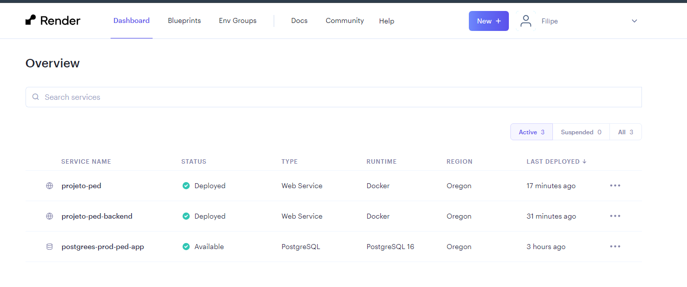

# Host em Render
Foi testado heroku, mas o free tier dele nao existe mamis.

As vezes o host em render não funciona (ele reestarta novamente).

Link: https://projeto-ped.onrender.com



# Build com Docker local
front-end e back-end e atualizar portas
```sh
cd .\frontend docker build -t client-pedidos .
```

```sh
cd .\backend docker build -t server-pedidos .
```
com docker-compose
```sh
docker-compose up
```


# Fluxo de dados (Frontend e Backend)

React Admin(Service integrado no data provider do Framework) -> Controller (Endpoints de API com Java Spring-boot) -> Service -> Repository -> Banco de Dados

## Pré-requisitos

- Node.js ^18.x.x com npm
- Java 21
- Maven (Caso nao usar o Intellij IDEA)
- IDE (Intellij IDEA recomendado)
- Banco de Dados H2 ou postgres (Já integrado no Projeto)

## Instalação do Frontend

Instale as dependências do projeto com o comando, na pasta raiz do projeto /frontend:

```sh
npm install
```

## Desenvolvimento

Inicie o servidor de desenvolvimento com o comando:

```sh
npm run dev
```

Crie um arquivo `.env` na pasta raiz do projeto /frontend com o seguinte conteúdo:

Se você estiver usando o backend localmente, use o seguinte conteúdo:
```sh
VITE_DEV_REST_URL=http://localhost:8080/api/v1
VITE_PROD_REST_URL=''
```


## Instalação do Backend

Recomendamos que você IntelliJ IDEA para abrir o projeto, mas você pode usar qualquer IDE de sua preferência.

Instale as dependências do do arquivo pom.xml, na pasta raiz do projeto /backend

Intellij IDEA: Tem Maven integrado (comando mvn é dele), basta abrir e clicar para instalar as dependências.

```sh
mvn clean install
```

## Desenvolvimento

Inicie o servidor spring boot com o comando:

Intellij IDEA: Clique com o botão direito no arquivo e execute o arquivo `backend/src/main/java/com/projetosintegrados/ProjetosintegradosApplication.java`

```sh
mvn spring-boot:run
```

## Banco de Dados

O banco de dados utilizado é o H2 (Por motivos de teste), que é um banco de dados em memória. 

Normalmente ele é criado automaticamente quando o servidor é iniciado, 
mas caso de erro, crie um arquivo `dcbapp.mv.db` na pasta `C:\Users\{seu_usuario}\`.

```sh
C:\Users\{seu_usuario}\dcbapp.mv.db
```

## Configuração do Banco de Dados

Caso queira alterar a configuração do banco de dados, acesse o arquivo `application.properties` 
na pasta `backend/src/main/resources/` e altere as linhas comentadas, exemplo de postgres ja configurado.


## Links de apoio dev

- localhost:8080/h2-console (Banco de dados H2)
- localhost:8080/swagger-ui.html (Documentação da API)
- localhost:8080/api/v1 (API)
